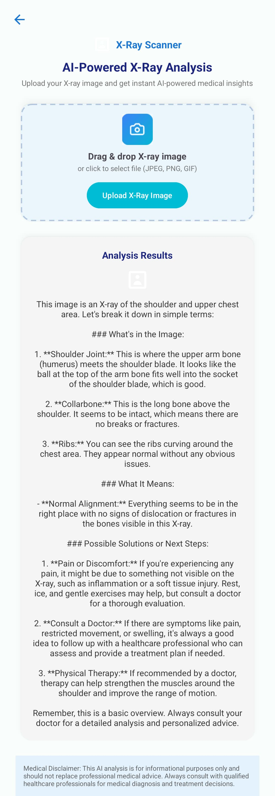
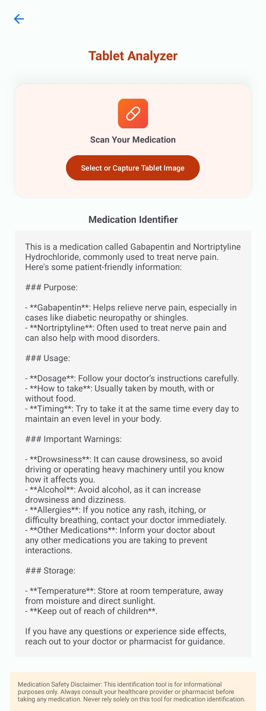
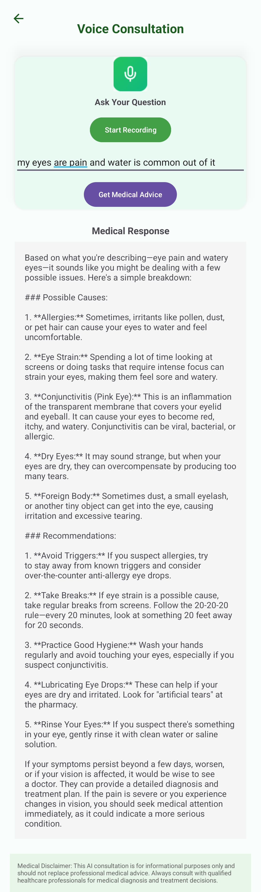

# 💡 HealthWhisper: Your AI-Powered Medical Companion

HealthWhisper is a smart and user-friendly mobile application that uses **Artificial Intelligence** to help patients understand medical data like **X-rays, blood reports, tablets**, and even **symptoms via voice**.

It’s like having a **mini doctor in your pocket**—fast, private, and always available.

---

## ✨ What Makes HealthWhisper Unique?

✅ Real-time X-ray analysis using AI  
✅ Speak your symptoms and get instant, doctor-style guidance  
✅ Decode complex medical reports into simple language  
✅ Scan tablets or prescriptions and know exactly what you're taking  
✅ Clean and dynamic interface, made for **patients**, not doctors

---

## 🩺 Core Features

### 🩻 1. X-ray Scanner
- Upload or click an X-ray image
- AI analyzes and explains the X-ray in understandable words

### 🎙️ 2. Voice to Explanation
- Talk about your symptoms using the mic
- AI listens and replies with medical suggestions like a real doctor

### 🧪 3. Medical Term Decoder
- Upload blood/lab reports
- AI explains what each parameter means and whether it's normal

### 💊 4. Tablet Analyzer
- Scan any medicine or prescription slip
- Get the tablet’s name, use, dose, and warnings

---

## 🧠 Tech Stack

- **Frontend**: React Native  
- **Backend**: Node.js / Python Flask  
- **AI Integration**: OpenAI GPT, Custom Medical APIs  
- **OCR**: Google Vision API / Tesseract  
- **Voice**: Whisper / Google Speech API  
- **Storage**: Firebase / AWS

---

## 📸 App Screenshots

(Upload the following screenshots to GitHub or an image host and update the links.)

| X-ray Scanner | Voice Chat | Report Decoder | Tablet Scanner |
|---------------|-------------|----------------|----------------|
|  |  |  |  |

---

## 🚀 Quick Start

```bash
git clone https://github.com/yourusername/HealthWhisper-AI-Medical-Assistant.git
cd HealthWhisper-AI-Medical-Assistant
npm install
npm start
