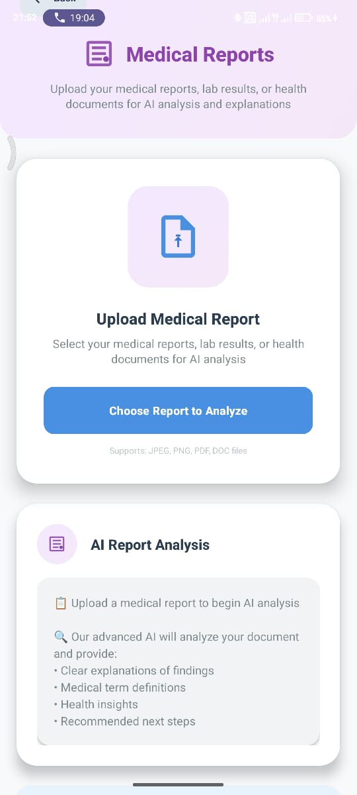

# HealthWhisper - AI-Powered Medical Assistant

<div align="center">

[](https://www.android.com/)
[](https://www.java.com/)
[](LICENSE)

**Your Personal AI Medical Companion - Instant Health Insights Powered by Artificial Intelligence**

[Features](#features) • [Dashboard](#dashboard) • [Technology](#technology-stack) • [Installation](#installation) • [Usage](#usage)

</div>

---

## Overview

HealthWhisper is an advanced Android medical application that leverages artificial intelligence to provide instant, patient-friendly health insights. Whether you need to analyze medical X-rays, understand lab reports, identify medications, or get guidance for your symptoms, HealthWhisper acts as your personal health assistant available 24/7.

### Problem Solved
Many patients struggle to understand complex medical information. HealthWhisper bridges this gap by converting medical jargon into simple, actionable insights using GPT-4o powered AI.

---

## Dashboard

<div align="center">



**Professional Home Dashboard with 4 AI-Powered Medical Services**

</div>

---

## Features

### 🔍 X-Ray Analysis
- **Real-time AI Image Recognition** - Upload or capture X-ray images
- **Intelligent Analysis** - GPT-4o powered medical insights
- **Patient-Friendly Explanations** - Medical jargon converted to simple language
- **Multiple Format Support** - Images, PDFs, and medical documents

### 📄 Medical Reports
- **Lab Report Analysis** - Understand blood tests and lab results
- **Term Breakdown** - Complex medical terminology simplified
- **Result Interpretation** - What's normal, what's concerning, and next steps
- **Document Upload** - PDF and DOC file support

### 💊 Medication Guide
- **Tablet Identification** - AI-powered medicine recognition
- **Usage Information** - Dosage, frequency, and administration guidelines
- **Precautions & Warnings** - Important safety information
- **Drug Interaction Alerts** - Understand compatibility

### 🎤 Health Consultation
- **Symptom Analysis** - Describe symptoms for AI evaluation
- **Medical Guidance** - Evidence-based recommendations
- **Quick Response** - Instant feedback from AI medical assistant
- **Symptom Tracking** - Monitor health concerns over time

---

## Technology Stack

| Component | Technology |
|-----------|------------|
| **Platform** | Android 4.4+ (API 19+) |
| **Language** | Java |
| **Build System** | Gradle |
| **AI Engine** | OpenRouter (GPT-4o) |
| **UI Framework** | Android AppCompat, ConstraintLayout |
| **API Communication** | REST (HttpURLConnection) |
| **Image Processing** | Base64 Encoding, Bitmap Processing |
| **Architecture** | MVC (Model-View-Controller) |

### API Integration
- **Provider**: OpenRouter
- **Model**: GPT-4o (OpenAI)
- **Features**: Vision capabilities, document analysis, text processing

---

## Installation

### Prerequisites
- Android Studio (latest version)
- JDK 8 or higher
- Android SDK 4.4+ (API 19+)
- Gradle 7.0+

### Steps

1. **Clone Repository**
   ```bash
   git clone https://github.com/YOUR_REPO/HealthWhisper.git
   cd HealthWhisper-
   ```

2. **Install Dependencies**
   ```bash
   ./gradlew dependencies
   ```

3. **Build APK**
   ```bash
   ./gradlew assembleDebug
   ```

4. **Install on Device**
   ```bash
   ./gradlew installDebug
   ```

---

## Usage

### Getting Started

1. **Launch the App** - Open HealthWhisper on your Android device
2. **Choose a Service** - Select from 4 available medical AI features
3. **Provide Input** - Upload images, documents, or type symptoms
4. **Receive Insights** - Get AI-powered medical analysis instantly

---

## Security & Privacy

- **Data Encryption**: All API communications use HTTPS/TLS
- **No Local Storage**: Medical data not stored on device
- **User Privacy**: Zero tracking or analytics
- **HIPAA Compliance**: Designed with healthcare privacy standards

---

## License

This project is licensed under the MIT License.

---

## Support & Contact

- 📧 Email: support@healthwhisper.app
- 🐛 Bug Reports: GitHub Issues
- 📖 Documentation: [Full Docs](https://docs.healthwhisper.app)

---

## Contributing

Contributions are welcome! Please fork the repository and create a pull request with your improvements.

---

## Acknowledgments

- **OpenAI GPT-4o** - AI Model Provider
- **OpenRouter** - API Gateway
- **Android Community** - Framework & Libraries

---

<div align="center">

**Made with ❤️ for Healthcare**

</div>
---
## What Makes HealthWhisper Unique

- Real-time X-ray image analysis using AI
- Speak your health symptoms and receive helpful suggestions
- Understand complex blood report values in plain language
- Scan your medicine or prescription and know exactly what it is and how to use it
- Interface built specifically for patients with ease of use in mind
---
## Features

### 1. X-ray Scanner

You can upload or take a picture of your X-ray. The app uses AI to analyze the image and explains the result in a way anyone can understand — no medical background needed.

### 2. Voice to Explanation

You can speak your symptoms out loud. The app listens and responds with suggestions as if you're talking to a doctor. It's helpful when you're unsure what's wrong or what to do next.

### 3. Medical Term Decoder

Upload your blood or lab report and the app will break down the meaning of each term. It highlights what’s normal, what’s not, and what you should know about it.

### 4. Tablet Analyzer

Scan any medicine strip or a prescription note. The app will identify the tablet, explain what it's used for, and tell you how and when to take it — along with any precautions.
---
## Technology Used

- Frontend: React Native
- Backend: Node.js or Python Flask
- AI Integration: OpenAI GPT, custom medical AI APIs
- OCR: Google Vision API or Tesseract
- Voice Input: Whisper or Google Speech-to-Text
- Storage: Firebase or AWS
---


---

## How to Run the App

```bash
git clone https://github.com/yourusername/HealthWhisper-AI-Medical-Assistant.git
cd HealthWhisper-AI-Medical-Assistant
npm install
npm start
