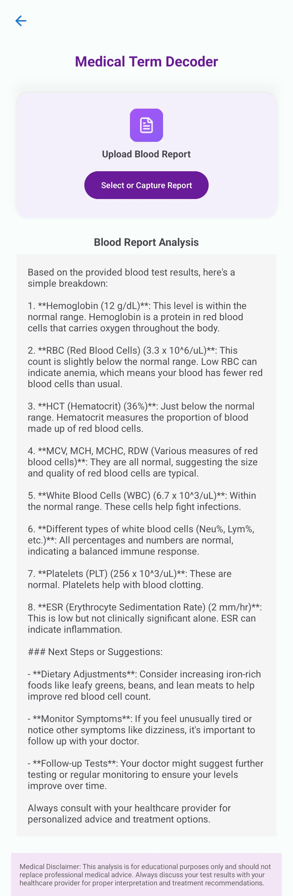

# HealthWhisper: Your AI-Powered Medical Companion

HealthWhisper is a mobile application designed to make healthcare easier and more understandable for everyone. With the help of artificial intelligence, users can get clear and simple explanations of medical information such as X-rays, blood reports, tablets, and even symptoms — just by speaking.

It works like a personal health assistant, available anytime.

---

## What Makes HealthWhisper Unique

- Real-time X-ray image analysis using AI
- Speak your health symptoms and receive helpful suggestions
- Understand complex blood report values in plain language
- Scan your medicine or prescription and know exactly what it is and how to use it
- Interface built specifically for patients with ease of use in mind

---

## Features

### 1. X-ray Scanner

You can upload or take a picture of your X-ray. The app uses AI to analyze the image and explains the result in a way anyone can understand — no medical background needed.

### 2. Voice to Explanation

You can speak your symptoms out loud. The app listens and responds with suggestions as if you're talking to a doctor. It's helpful when you're unsure what's wrong or what to do next.

### 3. Medical Term Decoder

Upload your blood or lab report and the app will break down the meaning of each term. It highlights what’s normal, what’s not, and what you should know about it.

### 4. Tablet Analyzer

Scan any medicine strip or a prescription note. The app will identify the tablet, explain what it's used for, and tell you how and when to take it — along with any precautions.

---

## Technology Used

- Frontend: React Native
- Backend: Node.js or Python Flask
- AI Integration: OpenAI GPT, custom medical AI APIs
- OCR: Google Vision API or Tesseract
- Voice Input: Whisper or Google Speech-to-Text
- Storage: Firebase or AWS

---

## 📸 App Screenshots


### Main App Interface  


### X-ray Scanner  


### Voice Assistant  


### Blood Report Decoder  


### Tablet Analyzer  



---

## How to Run the App

```bash
git clone https://github.com/yourusername/HealthWhisper-AI-Medical-Assistant.git
cd HealthWhisper-AI-Medical-Assistant
npm install
npm start
